  

## Hi, I'm Guilherme

I'm a full-stack developer from Brazil. Most of my time goes into building the software
Grupo Texas runs on: the platform where our teams organize their work, the dashboards
management uses to follow sales, commissions and finances, and the service that prepares
our files before they go online. I like taking a project from the first database table all
the way to the server it runs on, and that's usually how I work.

**Portfolio:** [guilhermecmt.github.io](https://guilhermecmt.github.io/), in Portuguese, with
screenshots and write-ups of my personal projects.

## What I've been building

At **Grupo Texas** I created **Hermest**, a work-management platform shaped around the way
the company actually operates. Boards, forms, automations, dashboards and Gantt charts live
in one place, and an MCP server lets AI agents work with it too. The goal from day one was
to cut fixed costs drastically by running on software we own and host ourselves instead of
paying for subscriptions, and over the last few months that's exactly what it has been
doing. Under the hood it's a Next.js and NestJS monorepo with Prisma and Redis. I also built the
**Dashboards Hub**, which puts the commercial, commission and finance dashboards behind a
single login, and **Compressor**, a FastAPI service that compresses and converts PDFs,
images, Office documents and videos on our own servers, so nothing has to be sent to
third-party sites. These repositories are private, which is why there are no links here.

On my own time I build these:

- **[Academia dos Sábios](https://guilhermecmt.github.io/projetos/academia-dos-sabios/)**:
  conversations with historical philosophers, rebuilt from their own works. Each character is
  data, not code, and the passages they quote come from critical editions, with the original
  Greek or Chinese next to the translation. [It's live](https://academia-dos-sabios-server.vercel.app).
- **[Alexandria](https://guilhermecmt.github.io/projetos/alexandria/)**: a white-label,
  multi-tenant learning platform where tenant isolation is enforced in three independent
  layers, down to PostgreSQL row-level security.
- **[Gymnous Mind](https://guilhermecmt.github.io/projetos/gymnous-mind/)**: a workout app for
  home, calisthenics and the gym, with 190+ exercises, generated workouts and automatic load
  progression. Desktop in Electron, with Android and iOS builds in Capacitor.
- **[StockGenius](https://guilhermecmt.github.io/projetos/stockgenius/)**: an investment
  decision engine for B3 and NYSE stocks. Fetching data and analysing it are separate steps,
  so every analysis runs offline and can be reproduced later.
- **[Rookgaard](https://guilhermecmt.github.io/projetos/rookgaard/)**: a Tibia-style 2D RPG in
  plain JavaScript and Canvas, with every sprite and sound generated by code.

Most of these are private. If you'd like to review the code of any of them, ask and I'll give
you access.

Two smaller projects are open source.
[HUB-LLM-LOCAL](https://github.com/Guilhermecmt/HUB-LLM-LOCAL) is a Windows tray app that
shows how much VRAM your GPU is using and frees the memory held by local LLMs with one
click. [Nous-Webui](https://github.com/Guilhermecmt/Nous-Webui) is my take on a private,
good-looking local AI setup, built on Ollama and Open WebUI.

## Tools I work with

Day to day I write mostly TypeScript and Python. These are the tools that keep showing up
in my projects:

  
  
  
  
  
  
  
  
  
  
  
  
  
  
  
  
  

## Get in touch

If you'd like to talk about a project or just say hi, you can email me at
[guilherme@texasseguros.com](mailto:guilherme@texasseguros.com) or call me at
+55&nbsp;71&nbsp;99128-3493.
